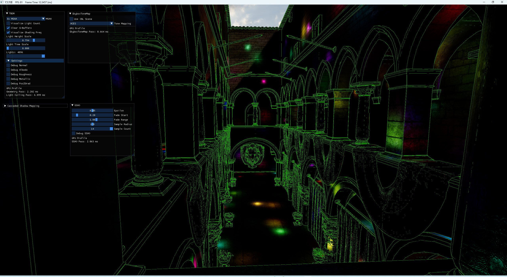
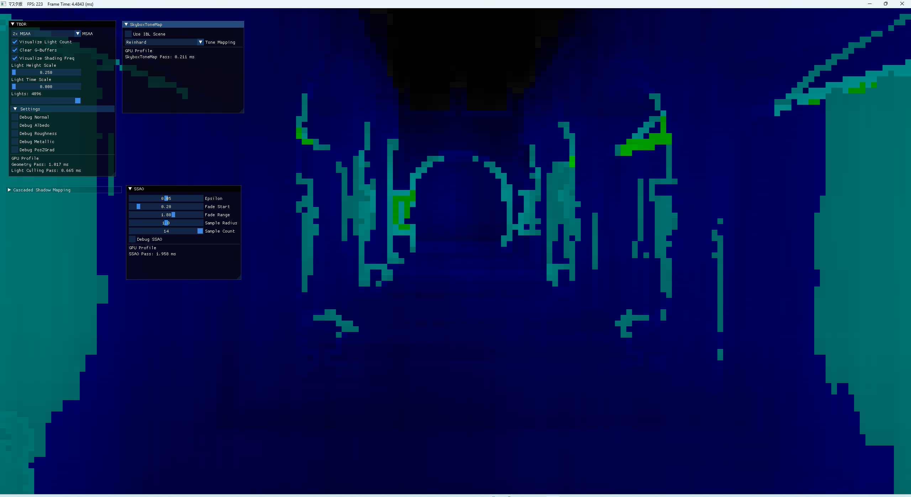
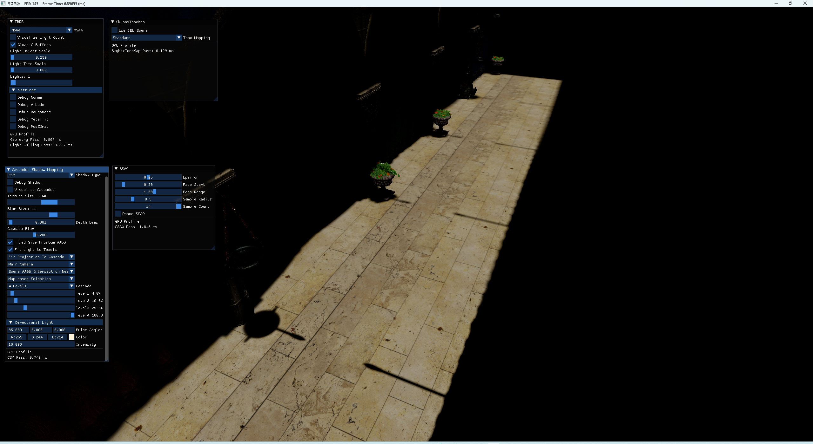
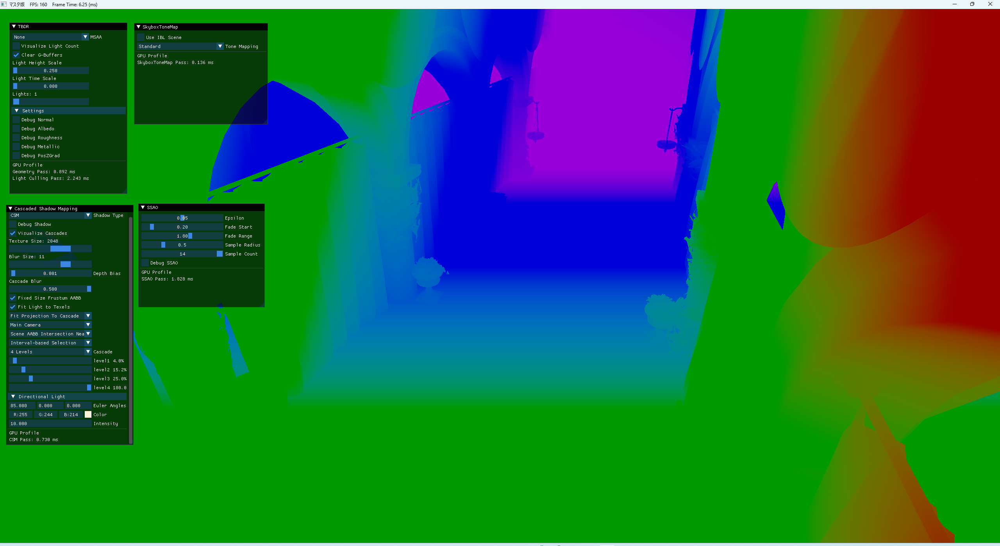
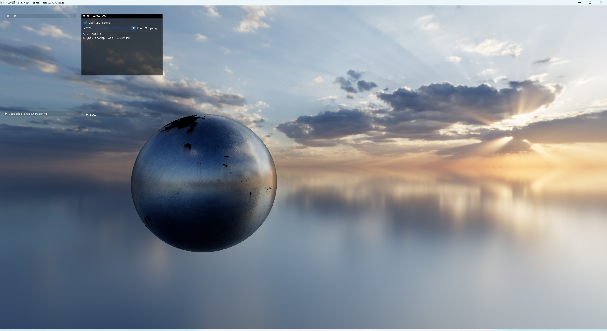

# Master

## 開発環境

- Windows SDK バージョン: `10.0.26100.0`
- C++ 言語標準: `ISO C++17 標準`
- ビルド構成: `Release x64`

## ビルド方法

1. `Common/Common.sln` を Visual Studio で開きます。
2. `Release x64`を選択します。
3. `Master`を右クリックします。
4. `スタートアップ プロジェクトに設定` を選択します。
5. `Release x64` を選択してビルドします。
6. 実行して動作を確認します。

## 実行方法

ビルド済みの実行ファイルを使用する場合は、以下の実行ファイルを起動してください。

```text
Master/
└─ Master.exe
```

または、各オブジェクトの実行ファイルを直接実行してください。

## 操作方法

| 操作 | 入力 |
|---|---|
| 移動 | `W` `A` `S` `D` |
| 視点移動 | マウス右クリックを押しながら移動 |

## 注意事項

- `MSAA_Visualize` の描画は、`PointLight` の範囲内で表示されます。
- `Visualize Cascades` を選択する際は、`PointLight` の数を `1` に設定してください。
- `Directional Light`の`Euler Angles`のxを85 前後に設定すると見やすくなります。
## Demo

YouTube :  
[YouTube確認動画①](https://youtu.be/5kdIer1NAag?si=fEFvOVRg8Fs6REFr)　　　　
　

[YouTube確認動画②](https://youtu.be/LhdRvvuLwb8?si=BJkPgEdHynYMl13D)

## Screenshots










