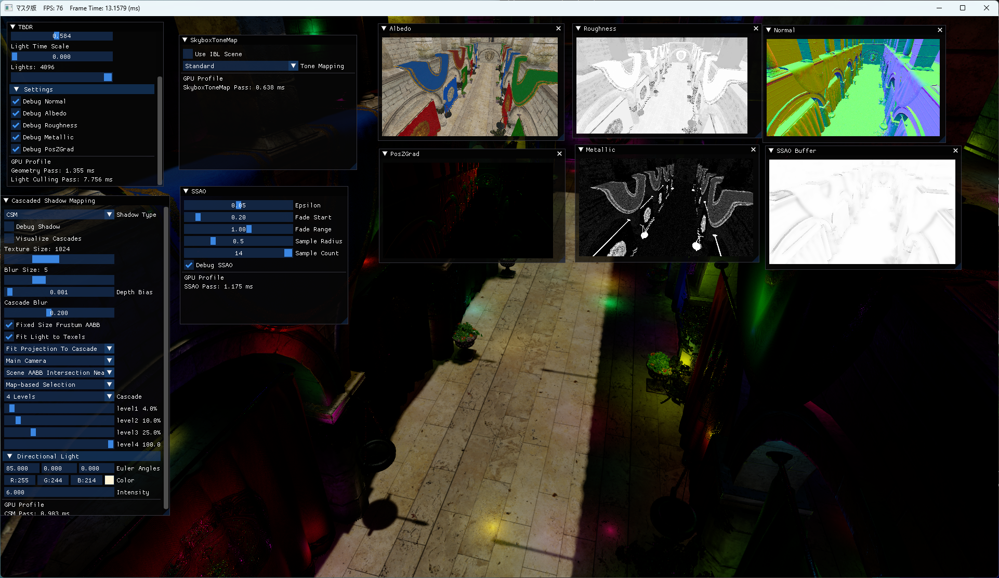
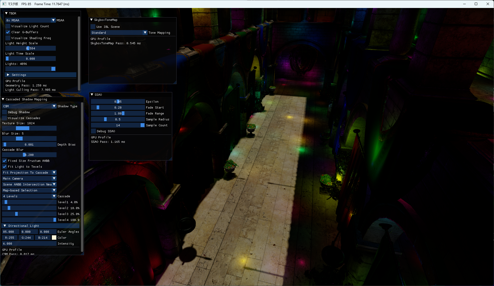
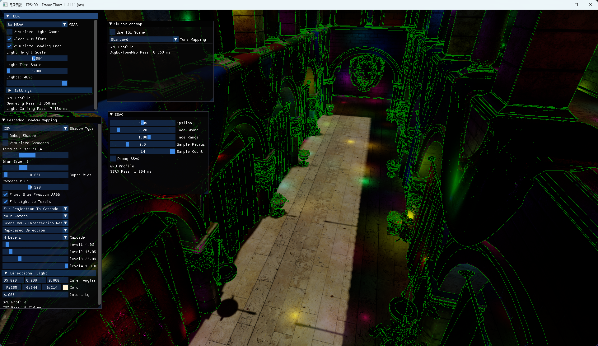
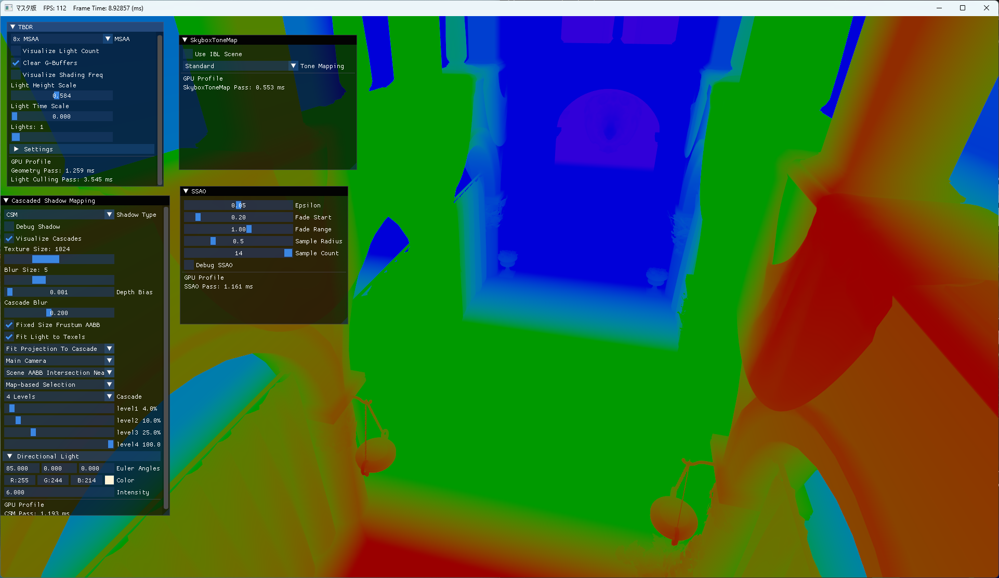
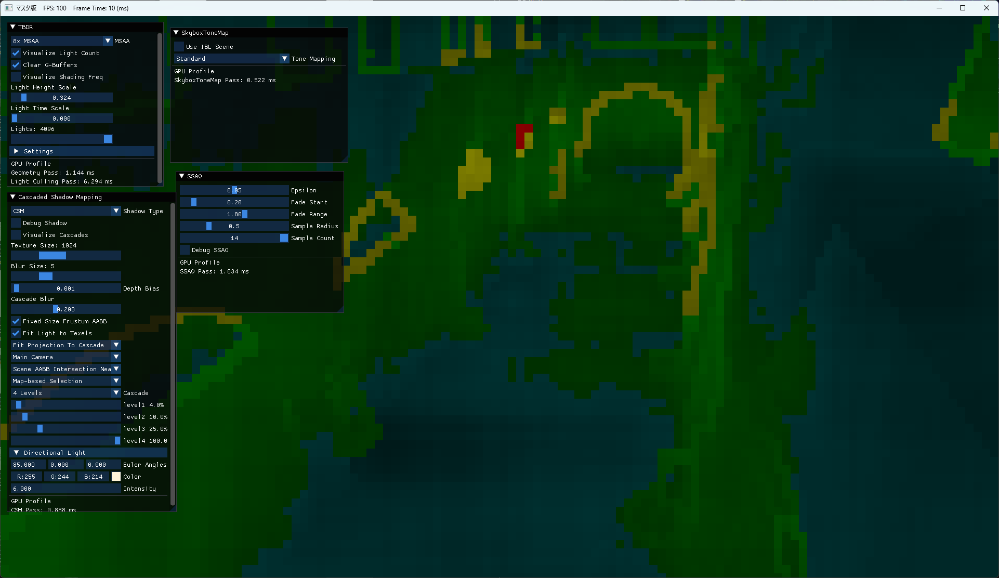

# DirectX11 Rendering Showcase
Tile-Based Deferred Rendering、Cascaded Shadow Mapping、SSAO、PBRなど、リアルタイムレンダリングで使用される複数の技術を 1 つのプロジェクト内に統合しています。            

本プロジェクトでは、単体のサンプル実装ではなく、複数のレンダリング技術を同じシーン内で組み合わせ、描画パイプライン、GPU リソース管理、シェーダー処理、ライティング、シャドウ、ポストエフェクトの流れを確認できる構成を目指しました。







## 主な特徴
- Tile-Based Deferred Rendering with 8xMSAA 4096 point lights
- Cascaded Shadow Mapping 
- Variance Shadow Map / Exponential Shadow Map / Exponential Variance Shadow Map
- Screen Space Ambient Occlusion
- Physically Based Rendering
- MSAA、GBuffer、Lighting Visualization
- Debug Visualization
- Image Based Lighting (implemented as a separate demo scene)

## 各手法で得たこと
0. Physically Based Rendering    
PBR の学習は、自分にとってレンダリングを数式や物理的な意味から考える大きなきっかけになりました。   
それまでは、インターネット上の実装例を参考にしても、各計算が何を意味しているのかを十分に理解できず、結果だけを真似してしまうことが多くありました。  
しかし PBR を学ぶ中で、Rendering Equation、BRDF、Radiometry に触れ、ライティングを数式や物理的な関係として捉えるようになりました。    
この経験を通して、これまで個別に学んできたレンダリング技術が一つの枠組みの中で整理され、理解がより深まりました。    
また、新しく学ぶ内容についても、数式や物理的な意味を手がかりに、各要素の役割や関係性を意識しながら理解できるようになりました。

1. Tile-Based Deferred Rendering      
GeometryとLightingを分離する考え方を学びました。さらに、画面を Tile 単位に分割し、各 Tile に影響するライトだけをリスト化することで、すべての Pixel で全ライトを評価する無駄を減らせます。     
この実装を通して、描画処理では「すべてを一度に処理する」のではなく、情報を一度整理し、必要な場所で必要な分だけ計算する設計が重要であると学びました。

2. Image Based Lighting  
IBL は個別のシーンとして実装しました。
IBL の学習を通して、Rendering Equation をリアルタイムでそのまま計算するのではなく、処理を分解し、事前計算を利用して近似する考え方を学びました。  
特に、Diffuse BRDF と Glossy BRDF の違いを通して、光の反射は材質特性によって扱い方が変わり、環境光もその性質に合わせて整理する必要があることを理解しました。     
3. Screen Space Ambient Occlusion  
SSAO の学習を通して、Ambient Occlusion を Screen Space 上で近似する考え方を学びました。  
AO は本来、着色点の周囲の半球方向に対して遮蔽の度合いを評価するものですが、リアルタイムで多数のレイを飛ばすことは現実的ではありません。   
この実装を通して、理論上の可視性判定をそのまま解くのではなく、Depth Buffer や Normal Buffer など既に描画された中間バッファを利用してリアルタイム向けに近似する重要性を学びました。
4. CSM/VSM/EVSM   
CSM、VSM、EVSM の学習を通して、リアルタイムシャドウは単にShadow Mapを比較する処理ではなく、解像度の分配、Filtering、安定性、Artifacts、Memory / Bandwidth のバランスを取る技術だと学びました。   
VSM / EVSM では、Shadow Test を単純な Depth Compare として扱うのではなく、Moments やチェビシェフの不等式などを用いて可視性を近似する発想が非常に新鮮でした。
5. Visualization  
Visualization の実装を通して、ゲームエンジンの機能は内部で正しく動作するだけでなく、使用する人が状態を理解し、調整できる形で提供することが重要だと学びました。  
レンダリング処理では、G-Buffer、Shadow Map、SSAO、Light Culling、各種 Debug View など、最終画面だけを見ても原因を判断しにくい中間データが多く存在します。   
それらを可視化することで、自分自身も各処理がどのように結果へ影響しているのかを直感的に確認でき、実装の理解を深めることができました。     
また、Debug View や Visualization は単なる確認用の機能ではなく、使用者が問題を理解し、調整しやすくするための重要な仕組みだと理解しました。
## 開発環境

- Windows SDK バージョン: `10.0.26100.0`
- C++ 言語標準: `ISO C++17 標準`
- ビルド構成: `Release x64`

## ビルド方法

1. `Common/Common.sln` を Visual Studio で開きます。
2. `Release x64`を選択します。
3. `Master`を右クリックします。
4. `スタートアップ プロジェクトに設定` を選択します。
5. `Release x64` を選択してビルドします。
6. 実行して動作を確認します。

## 実行方法

ビルド済みの実行ファイルを使用する場合は、以下の実行ファイルを起動してください。

```text
Master/
└─ Master.exe
```

または、各オブジェクトの実行ファイルを直接実行してください。

## 操作方法

| 操作 | 入力 |
|---|---|
| 移動 | `W` `A` `S` `D` |
| 視点移動 | マウス右クリックを押しながら移動 |

## 注意事項

- `MSAA_Visualize` の描画は、`PointLight` の範囲内で表示されます。
- `Visualize Cascades` を選択する際は、`PointLight` の数を `1` に設定してください。
- `Directional Light`の`Euler Angles`のxを85 前後に設定すると見やすくなります。
## Demo

YouTube :  
[YouTube確認動画①](https://youtu.be/5kdIer1NAag?si=fEFvOVRg8Fs6REFr)　　　　
　

[YouTube確認動画②](https://youtu.be/LhdRvvuLwb8?si=BJkPgEdHynYMl13D)

## Screenshots


